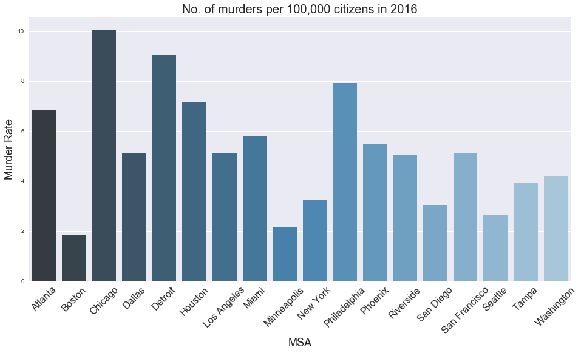
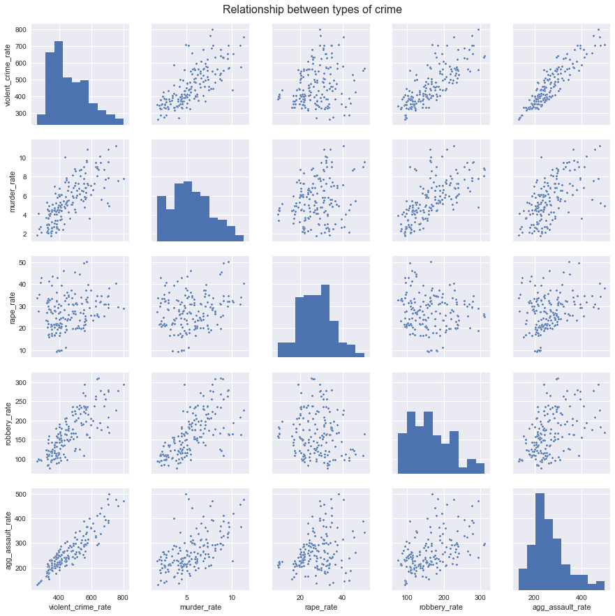
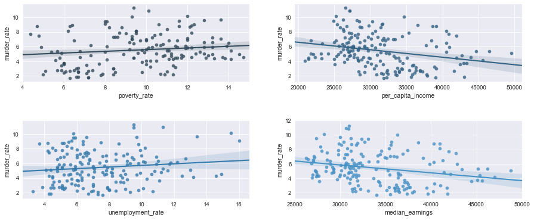
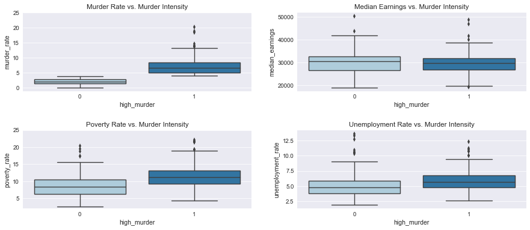

The following table shows us some of the main variables that we will be using for for our exploratory data analysis. We have annual observations of US Metropolitan State Areas for the period 2006-2016 with their respective IDs and with demographic variables such as total population, median income, poverty and education levels, among others. 


<div>
<style>
    .dataframe thead tr:only-child th {
        text-align: right;
    }

    .dataframe thead th {
        text-align: left;
    }

    .dataframe tbody tr th {
        vertical-align: top;
    }
</style>
<table border="1" class="dataframe">
  <thead>
    <tr style="text-align: right;">
      <th></th>
      <th>tot_pop</th>
      <th>msa_name</th>
      <th>msa_id</th>
      <th>year</th>
    </tr>
  </thead>
  <tbody>
    <tr>
      <th>168</th>
      <td>5790619.0</td>
      <td>Atlanta-Sandy Springs-Roswell, GA</td>
      <td>12060.0</td>
      <td>2016.0</td>
    </tr>
    <tr>
      <th>169</th>
      <td>5704839.0</td>
      <td>Atlanta-Sandy Springs-Roswell, GA</td>
      <td>12060.0</td>
      <td>2015.0</td>
    </tr>
    <tr>
      <th>170</th>
      <td>5597635.0</td>
      <td>Atlanta-Sandy Springs-Roswell, GA</td>
      <td>12060.0</td>
      <td>2014.0</td>
    </tr>
    <tr>
      <th>171</th>
      <td>5511212.0</td>
      <td>Atlanta-Sandy Springs-Roswell, GA</td>
      <td>12060.0</td>
      <td>2013.0</td>
    </tr>
    <tr>
      <th>172</th>
      <td>5434540.0</td>
      <td>Atlanta-Sandy Springs-Marietta, GA</td>
      <td>12060.0</td>
      <td>2012.0</td>
    </tr>
  </tbody>
</table>
</div>


```python
df_small_2016= df_small[df_small['year'] == 2016]
```


In our database we have over 400 MSAs for each available year. For simplicity, we limit our preliminary analysis to the MSAs with the largest populations. Although MSAs are generally composed of 2-3 cities, here we name them after their largest city. 

The 18 MSAs chosen for the analysis and their respective populations in 2016 are shown below. 





Because the purpose of our analysis is to build a model to predict murder in the next few years, below we show the average number of reported murders per 100,000 inhabitants for the chosen MSAs across 2006-2016. From the graph below we can see that the MSAs with the highest murder rates (among the MSAs chosen) are those corresponding to Detroit-Warren-Livonia and New York-Newark-Jersey City. 


We have a rich FBI database that includes data on other type of crimes such as rape, robbery, assault, and violent crime.

When we assess the correlation between these different types of crime we can see that they are highly correlated among themselves. Although we are limiting our analysis to murder cases, the high correlation between these  suggest that there are general patterns that are consistent across different types of crimes, and an increasing trend in the number of reported murders might be indicative of similar trends among other types of crime. 





When we assess the number of reported murders per 100,000 inhabitants across these 18 MSAs we identify an upward trend: for the largest MSAs in the US the number of reported murders has been increasing in the last 10 years. 


    <matplotlib.text.Text at 0x11e265438>


    18


We assess the correlation between murder rates and some of the demographic variables available in the census data. In general, we observe patterns that are consistent with what one would expect:

1. MSAs with higher poverty rates are associated with higher murder rates.
2. MSAs with higher income per capita or with higher levels of median earnings are associated with higher murder rates. 
3. MSAs with higher unemployment rates are associated with higher murder rates. 





For the following analysis we use all 400+ MSAs in the US and limit our sample to the year 2016. Moreover, we create a variable for "high-murder" areas, where "high-murder" areas are those MSAs where the murder rate exceeds the median murder rate for 2016, which was approximately 4. 

By doing this we observe some interesting differences between high vs. low murder areas. First, we see that poverty rates are on average higher in high-murder areas than in low-murder ones. Second, we find that there's on average higher unemployment rates in high-murder areas. 

Our most interesting finding is related to median earnings. We observe that, on average, median income across these two types of areas is very similar. The main difference is that there's slightly less variation in median income in high-murder areas (median incomes are concentrated closer to their mean). Although this is not part of the scope of our analysis, it'd be interesting to assess variation of median income *within* MSAs, as it might be the case that although median income is the same, there might be large variation (and therefore inequality) within MSAs. 





```python

```

