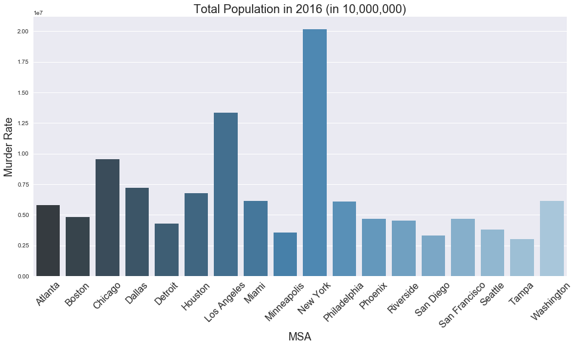
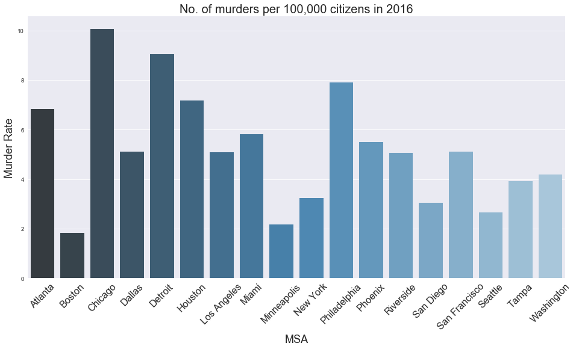
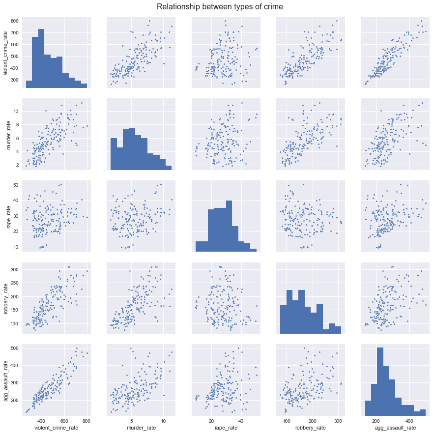
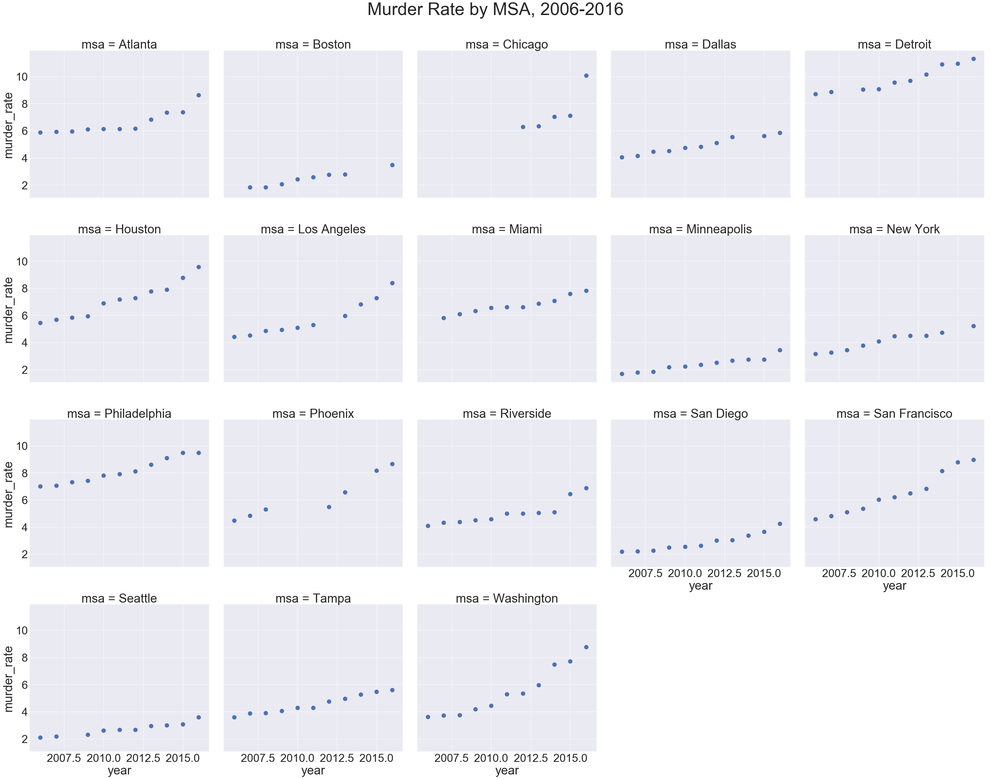
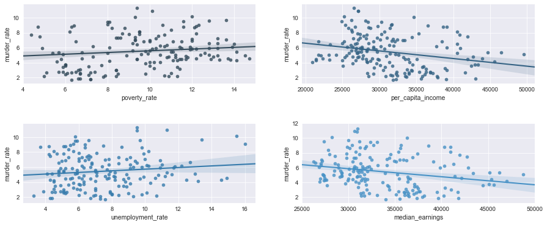
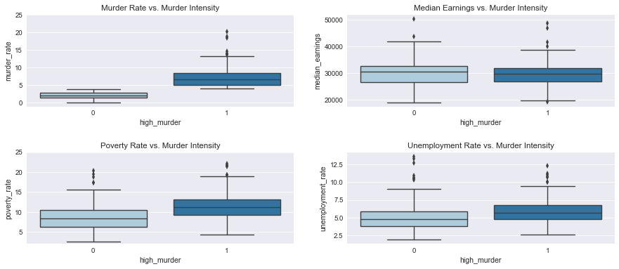

```python
df_small = df[df['msa_id'].isin(df.loc[df['tot_pop'] > 3000000, 'msa_id'])]
df_small[['tot_pop', 'msa_name', 'msa_id', 'year']].head()

```


<div>
<style>
    .dataframe thead tr:only-child th {
        text-align: right;
    }

    .dataframe thead th {
        text-align: left;
    }

    .dataframe tbody tr th {
        vertical-align: top;
    }
</style>
<table border="1" class="dataframe">
  <thead>
    <tr style="text-align: right;">
      <th></th>
      <th>tot_pop</th>
      <th>msa_name</th>
      <th>msa_id</th>
      <th>year</th>
    </tr>
  </thead>
  <tbody>
    <tr>
      <th>168</th>
      <td>5790619.0</td>
      <td>Atlanta-Sandy Springs-Roswell, GA</td>
      <td>12060.0</td>
      <td>2016.0</td>
    </tr>
    <tr>
      <th>169</th>
      <td>5704839.0</td>
      <td>Atlanta-Sandy Springs-Roswell, GA</td>
      <td>12060.0</td>
      <td>2015.0</td>
    </tr>
    <tr>
      <th>170</th>
      <td>5597635.0</td>
      <td>Atlanta-Sandy Springs-Roswell, GA</td>
      <td>12060.0</td>
      <td>2014.0</td>
    </tr>
    <tr>
      <th>171</th>
      <td>5511212.0</td>
      <td>Atlanta-Sandy Springs-Roswell, GA</td>
      <td>12060.0</td>
      <td>2013.0</td>
    </tr>
    <tr>
      <th>172</th>
      <td>5434540.0</td>
      <td>Atlanta-Sandy Springs-Marietta, GA</td>
      <td>12060.0</td>
      <td>2012.0</td>
    </tr>
  </tbody>
</table>
</div>


This table shows us some of the main variables that we will be using for for our exploratory data analysis. We have annual observations of US Metropolitan State Areas for the period 2006-2016 with their respective IDs and with demographic variables such as total population, median income, poverty and education levels, among others. 


In our database we have over 400 MSAs for each available year. For simplicity, we limit our preliminary analysis to the MSAs with the largest populations. Although MSAs are generally composed of 2-3 cities, here we name them after their largest city. 

The 18 MSAs chosen for the analysis and their respective populations in 2016 are shown below. 


    [<matplotlib.text.Text at 0x1215f9908>,
     <matplotlib.text.Text at 0x11e195828>,
     <matplotlib.text.Text at 0x121d66b70>,
     <matplotlib.text.Text at 0x121d6d668>,
     <matplotlib.text.Text at 0x121d72160>,
     <matplotlib.text.Text at 0x121d72c18>,
     <matplotlib.text.Text at 0x121d79710>,
     <matplotlib.text.Text at 0x121d7d208>,
     <matplotlib.text.Text at 0x121d7dcc0>,
     <matplotlib.text.Text at 0x121d847b8>,
     <matplotlib.text.Text at 0x121d8b2b0>,
     <matplotlib.text.Text at 0x121d8bd68>,
     <matplotlib.text.Text at 0x121d91860>,
     <matplotlib.text.Text at 0x121d98358>,
     <matplotlib.text.Text at 0x121d98e10>,
     <matplotlib.text.Text at 0x121d9e908>,
     <matplotlib.text.Text at 0x121da3400>,
     <matplotlib.text.Text at 0x121da3eb8>]





    [<matplotlib.text.Text at 0x14902af98>,
     <matplotlib.text.Text at 0x1492bd710>,
     <matplotlib.text.Text at 0x147b5d358>,
     <matplotlib.text.Text at 0x147ac8240>,
     <matplotlib.text.Text at 0x147b53c18>,
     <matplotlib.text.Text at 0x147b53198>,
     <matplotlib.text.Text at 0x147aadf60>,
     <matplotlib.text.Text at 0x1493e5be0>,
     <matplotlib.text.Text at 0x1493e53c8>,
     <matplotlib.text.Text at 0x145723588>,
     <matplotlib.text.Text at 0x145943e10>,
     <matplotlib.text.Text at 0x110d47940>,
     <matplotlib.text.Text at 0x145287550>,
     <matplotlib.text.Text at 0x141ef4a90>,
     <matplotlib.text.Text at 0x145cd4400>,
     <matplotlib.text.Text at 0x145ca39e8>,
     <matplotlib.text.Text at 0x145ca3198>,
     <matplotlib.text.Text at 0x1456f2d30>]





Because the purpose of our analysis is to build a model to predict murder in the next few years, below we show the average number of reported murders per 100,000 inhabitants for the chosen MSAs across 2006-2016. From the graph below we can see that the MSAs with the highest murder rates (among the MSAs chosen) are those corresponding to Detroit-Warren-Livonia and New York-Newark-Jersey City. 


    [<matplotlib.text.Text at 0x11211ada0>,
     <matplotlib.text.Text at 0x1126393c8>,
     <matplotlib.text.Text at 0x1127bec18>,
     <matplotlib.text.Text at 0x11279b710>,
     <matplotlib.text.Text at 0x1127ce208>,
     <matplotlib.text.Text at 0x1127cecc0>,
     <matplotlib.text.Text at 0x1127ba7b8>,
     <matplotlib.text.Text at 0x1127a12b0>,
     <matplotlib.text.Text at 0x1127a1d68>,
     <matplotlib.text.Text at 0x1127c4860>,
     <matplotlib.text.Text at 0x1127b9358>,
     <matplotlib.text.Text at 0x1127b9e10>,
     <matplotlib.text.Text at 0x1121a7908>,
     <matplotlib.text.Text at 0x1121d4400>,
     <matplotlib.text.Text at 0x1121d4eb8>,
     <matplotlib.text.Text at 0x1121b89b0>,
     <matplotlib.text.Text at 0x1121c84a8>,
     <matplotlib.text.Text at 0x1121c8f60>]


We have a rich FBI database that includes data on other type of crimes such as rape, robbery, assault, and violent crime.

When we assess the correlation between these different types of crime we can see that they are highly correlated among themselves. Although we are limiting our analysis to murder cases, the high correlation between these  suggest that there are general patterns that are consistent across different types of crimes, and an increasing trend in the number of reported murders might be indicative of similar trends among other types of crime. 


    <matplotlib.text.Text at 0x111a93e80>





When we assess the number of reported murders per 100,000 inhabitants across these 18 MSAs we identify an upward trend: for the largest MSAs in the US the number of reported murders has been increasing in the last 10 years. 


```python
df_small["msa"] = df_small["msa_id"].map({12060: "Atlanta", 14460: "Boston", 16980: "Chicago", 19100: "Dallas", 19820: "Detroit", 26420: "Houston", 31100: "Los Angeles", 33100: "Miami", 33460: "Minneapolis", 35620: "New York", 37980: "Philadelphia", 38060: "Phoenix", 40140: "Riverside", 41740: "San Diego", 41860: "San Francisco", 42660: "Seattle", 45300: "Tampa", 47900:"Washington"})


```


    <matplotlib.text.Text at 0x141e5fba8>





    18


We assess the correlation between murder rates and some of the demographic variables available in the census data. In general, we observe patterns that are consistent with what one would expect:

1. MSAs with higher poverty rates are associated with higher murder rates.
2. MSAs with higher income per capita or with higher levels of median earnings are associated with higher murder rates. 
3. MSAs with higher unemployment rates are associated with higher murder rates. 


```python
sns.set_palette("Blues_d")


sns.set_context("paper", font_scale=1.2)                                                  

fig, ((ax1, ax2),(ax3,ax4)) = plt.subplots(2,2, figsize = (15, 6), facecolor = 'w', edgecolor = 'k', sharey = False)

sns.regplot(x="poverty_rate", y="murder_rate", data=df_small, ax=ax1)
sns.regplot(x="per_capita_income", y="murder_rate", data=df_small, ax=ax2)
sns.regplot(x='unemployment_rate', y="murder_rate", data=df_small, ax=ax3)
sns.regplot(x='median_earnings', y="murder_rate", data=df_small, ax=ax4)

ax1.set_xlim([4,15]) 
ax4.set_xlim([25000,50000]) 

fig.subplots_adjust(hspace = 0.5, wspace=.2)


```





For the following analysis we use all 400+ MSAs in the US and limit our sample to the year 2016. Moreover, we create a variable for "high-murder" areas, where "high-murder" areas are those MSAs where the murder rate exceeds the median murder rate for 2016, which was approximately 4. 

By doing this we observe some interesting differences between high vs. low murder areas. First, we see that poverty rates are on average higher in high-murder areas than in low-murder ones. Second, we find that there's on average higher unemployment rates in high-murder areas. 

Our most interesting finding is related to median earnings. We observe that, on average, median income across these two types of areas is very similar. The main difference is that there's slightly less variation in median income in high-murder areas (median incomes are concentrated closer to their mean). Although this is not part of the scope of our analysis, it'd be interesting to assess variation of median income *within* MSAs, as it might be the case that although median income is the same, there might be large variation (and therefore inequality) within MSAs. 





```python
df_2016['murder_rate'].describe()

```


    count    345.000000
    mean       4.593020
    std        3.353137
    min        0.000000
    25%        2.024210
    50%        3.932137
    75%        6.529759
    max       20.197940
    Name: murder_rate, dtype: float64


