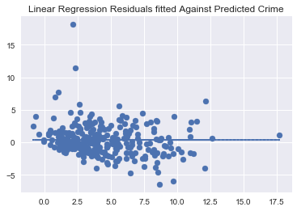
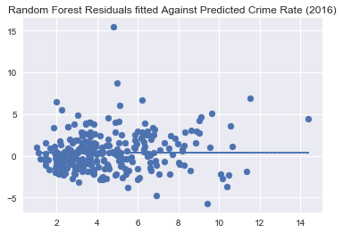
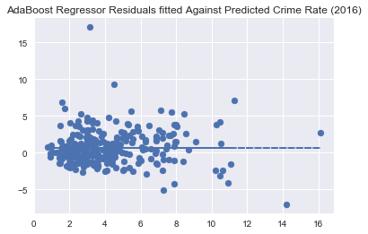
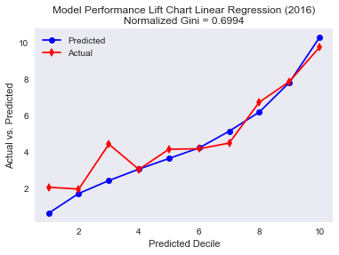
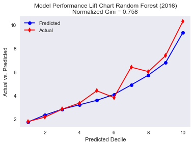
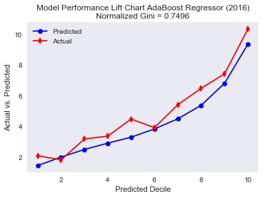
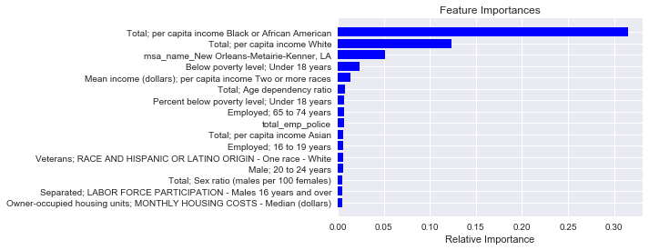

```python
# importing the data 
df = pd.read_csv('Crime_Census_Employment.csv')
#df = pd.read_csv('Crime_Census_Merged_No_Impute_No_Dummies_NEW (2).csv')
```


For this project we worked with two different datasets. Both datasets contain the FBI crime data and census data merged at the Metropolitan Statistical Area (MSA) level. Our baseline model (OLS) uses data from the census (MSA demographics, population, employment, level of education, etc.) to predict murder rate, while our enhanced models (Random Forest, Adaboost, OLS) include more variables such as the number of police available in the MSA, the number of mental health workers, and their respective salaries per hour. 


```python
df.head()
```


<div>
<style>
    .dataframe thead tr:only-child th {
        text-align: right;
    }

    .dataframe thead th {
        text-align: left;
    }

    .dataframe tbody tr th {
        vertical-align: top;
    }
</style>
<table border="1" class="dataframe">
  <thead>
    <tr style="text-align: right;">
      <th></th>
      <th>Unnamed: 0</th>
      <th>msa_name</th>
      <th>msa_id</th>
      <th>year</th>
      <th>tot_pop</th>
      <th>rep_violent_crime</th>
      <th>rep_murder</th>
      <th>rep_rape</th>
      <th>rep_robbery</th>
      <th>rep_agg_assault</th>
      <th>rep_pro_crime</th>
      <th>rep_burglary</th>
      <th>rep_theft</th>
      <th>rep_veh_theft</th>
      <th>All families - Percent below poverty level; Families</th>
      <th>All families - Total; Families</th>
      <th>Below poverty level; 18 to 64 years</th>
      <th>Below poverty level; 65 years and over</th>
      <th>Below poverty level; Under 18 years</th>
      <th>Below poverty level; EDUCATIONAL ATTAINMENT - Population 25 years and over</th>
      <th>Below poverty level; EMPLOYMENT STATUS - Civilian labor force 16 years and over</th>
      <th>Below poverty level; RACE AND HISPANIC OR LATINO ORIGIN - One race - White</th>
      <th>Below poverty level; Female</th>
      <th>Below poverty level; Male</th>
      <th>Below poverty level; Unrelated individuals for whom poverty status is determined</th>
      <th>Below poverty level; WORK EXPERIENCE - Population 16 years and over</th>
      <th>Divorced; LABOR FORCE PARTICIPATION - Males 16 years and over</th>
      <th>Divorced; Population 15 years and over</th>
      <th>Employed; 16 to 19 years</th>
      <th>Employed; 20 to 24 years</th>
      <th>Employed; 25 to 44 years</th>
      <th>Employed; 45 to 54 years</th>
      <th>Employed; 55 to 64 years</th>
      <th>Employed; 65 to 74 years</th>
      <th>Employed; 75 years and over</th>
      <th>Employed; EDUCATIONAL ATTAINMENT - Population 25 to 64 years</th>
      <th>Employed; Population 16 years and over</th>
      <th>Employed; Population 20 to 64 years</th>
      <th>Employed; RACE AND HISPANIC OR LATINO ORIGIN - One race - White</th>
      <th>Female householder, no husband present - Percent below poverty level; Families</th>
      <th>Female householder, no husband present - Total; Families</th>
      <th>Female; 10 to 14 years</th>
      <th>Female; 15 to 19 years</th>
      <th>Female; 20 to 24 years</th>
      <th>Female; 25 to 29 years</th>
      <th>Female; 30 to 34 years</th>
      <th>Female; 35 to 39 years</th>
      <th>Female; 40 to 44 years</th>
      <th>Female; 45 to 49 years</th>
      <th>Female; 5 to 9 years</th>
      <th>...</th>
      <th>Total; Population 18 to 24 years_y</th>
      <th>Total; Population 20 to 64 years</th>
      <th>Total; Population 25 years and over</th>
      <th>Total; Population 3 years and over enrolled in school</th>
      <th>Total; Population 35 to 44 years</th>
      <th>Total; Population 45 to 64 years</th>
      <th>Total; Population 65 years and over</th>
      <th>Total; Age dependency ratio</th>
      <th>Total; Median age (years)</th>
      <th>Total; Sex ratio (males per 100 females)</th>
      <th>Total; Total population</th>
      <th>Total; Did not work</th>
      <th>Total; Worked 1 to 13 weeks</th>
      <th>Total; Worked 14 to 26 weeks</th>
      <th>Total; Worked 27 to 39 weeks</th>
      <th>Total; Worked 40 to 49 weeks</th>
      <th>Total; Worked 50 to 52 weeks</th>
      <th>Total; WORK EXPERIENCE - Population 16 years and over</th>
      <th>Total; WORK STATUS - Families</th>
      <th>Unemployment rate; 16 to 19 years</th>
      <th>Unemployment rate; 20 to 24 years</th>
      <th>Unemployment rate; 25 to 44 years</th>
      <th>Unemployment rate; 45 to 54 years</th>
      <th>Unemployment rate; 55 to 64 years</th>
      <th>Unemployment rate; 65 to 74 years</th>
      <th>Unemployment rate; 75 years and over</th>
      <th>Unemployment rate; EDUCATIONAL ATTAINMENT - Population 25 to 64 years</th>
      <th>Unemployment rate; Population 16 years and over</th>
      <th>Unemployment rate; Population 20 to 64 years</th>
      <th>Unemployment rate; RACE AND HISPANIC OR LATINO ORIGIN - One race - White</th>
      <th>Veterans; 18 to 34 years</th>
      <th>Veterans; 35 to 54 years</th>
      <th>Veterans; 55 to 64 years</th>
      <th>Veterans; 65 to 74 years</th>
      <th>Veterans; 75 years and over</th>
      <th>Veterans; Civilian population 18 years and over</th>
      <th>Veterans; EDUCATIONAL ATTAINMENT</th>
      <th>Veterans; EMPLOYMENT STATUS</th>
      <th>Veterans; PERIOD OF SERVICE - Korean War veterans</th>
      <th>Veterans; PERIOD OF SERVICE - Vietnam era veterans</th>
      <th>Veterans; PERIOD OF SERVICE - World War II veterans</th>
      <th>Veterans; RACE AND HISPANIC OR LATINO ORIGIN - One race - White</th>
      <th>Veterans; Female</th>
      <th>Veterans; Male</th>
      <th>Widowed; LABOR FORCE PARTICIPATION - Males 16 years and over</th>
      <th>Widowed; Population 15 years and over</th>
      <th>hourly_wage_mental_health</th>
      <th>hourly_wage_police</th>
      <th>total_emp_mental_health</th>
      <th>total_emp_police</th>
    </tr>
  </thead>
  <tbody>
    <tr>
      <th>0</th>
      <td>0</td>
      <td>Abilene, TX</td>
      <td>10180.0</td>
      <td>2016.0</td>
      <td>169885.0</td>
      <td>614.0</td>
      <td>11.0</td>
      <td>79.0</td>
      <td>137.0</td>
      <td>387.0</td>
      <td>4932.0</td>
      <td>1104.0</td>
      <td>530.0</td>
      <td>298.0</td>
      <td>10.9</td>
      <td>38610.0</td>
      <td>16605.0</td>
      <td>2599.0</td>
      <td>7690.0</td>
      <td>15034.0</td>
      <td>7682.0</td>
      <td>21007.0</td>
      <td>14320.0</td>
      <td>12574.0</td>
      <td>12746.0</td>
      <td>19989.0</td>
      <td>9.3</td>
      <td>10.9</td>
      <td>28.6</td>
      <td>59.6</td>
      <td>NaN</td>
      <td>67.6</td>
      <td>NaN</td>
      <td>27.9</td>
      <td>7.4</td>
      <td>65.5</td>
      <td>52.9</td>
      <td>64.6</td>
      <td>54.7</td>
      <td>29.7</td>
      <td>7677.0</td>
      <td>7.0</td>
      <td>7.0</td>
      <td>8.2</td>
      <td>7.3</td>
      <td>6.8</td>
      <td>6.0</td>
      <td>4.5</td>
      <td>5.0</td>
      <td>6.8</td>
      <td>...</td>
      <td>21091.0</td>
      <td>98190.0</td>
      <td>109703.0</td>
      <td>44265.0</td>
      <td>18904.0</td>
      <td>38498.0</td>
      <td>26080.0</td>
      <td>63.2</td>
      <td>34.4</td>
      <td>104.9</td>
      <td>170860.0</td>
      <td>31639.0</td>
      <td>5639.0</td>
      <td>3844.0</td>
      <td>3640.0</td>
      <td>NaN</td>
      <td>60767.0</td>
      <td>121346.0</td>
      <td>38610.0</td>
      <td>10.4</td>
      <td>3.3</td>
      <td>NaN</td>
      <td>2.3</td>
      <td>NaN</td>
      <td>5.3</td>
      <td>0.0</td>
      <td>3.5</td>
      <td>3.9</td>
      <td>3.5</td>
      <td>4.0</td>
      <td>2226.0</td>
      <td>3041.0</td>
      <td>2624.0</td>
      <td>3326.0</td>
      <td>2388.0</td>
      <td>13605.0</td>
      <td>13583.0</td>
      <td>7891.0</td>
      <td>867.0</td>
      <td>4712.0</td>
      <td>449.0</td>
      <td>11897.0</td>
      <td>740.0</td>
      <td>12865.0</td>
      <td>2.5</td>
      <td>5.5</td>
      <td>18.71</td>
      <td>27.41</td>
      <td>90.0</td>
      <td>400.0</td>
    </tr>
    <tr>
      <th>1</th>
      <td>1</td>
      <td>Abilene, TX</td>
      <td>10180.0</td>
      <td>2015.0</td>
      <td>169713.0</td>
      <td>700.0</td>
      <td>9.0</td>
      <td>95.0</td>
      <td>133.0</td>
      <td>463.0</td>
      <td>6125.0</td>
      <td>1446.0</td>
      <td>232.0</td>
      <td>447.0</td>
      <td>9.9</td>
      <td>37669.0</td>
      <td>13275.0</td>
      <td>1718.0</td>
      <td>6658.0</td>
      <td>11047.0</td>
      <td>7066.0</td>
      <td>14496.0</td>
      <td>12397.0</td>
      <td>9254.0</td>
      <td>9716.0</td>
      <td>15476.0</td>
      <td>11.9</td>
      <td>12.0</td>
      <td>31.5</td>
      <td>59.2</td>
      <td>NaN</td>
      <td>72.2</td>
      <td>NaN</td>
      <td>26.6</td>
      <td>6.8</td>
      <td>67.2</td>
      <td>54.5</td>
      <td>65.8</td>
      <td>55.2</td>
      <td>32.6</td>
      <td>7324.0</td>
      <td>6.4</td>
      <td>7.5</td>
      <td>9.3</td>
      <td>7.1</td>
      <td>5.9</td>
      <td>5.3</td>
      <td>5.7</td>
      <td>5.2</td>
      <td>6.4</td>
      <td>...</td>
      <td>23166.0</td>
      <td>99599.0</td>
      <td>106507.0</td>
      <td>44634.0</td>
      <td>19514.0</td>
      <td>39594.0</td>
      <td>23990.0</td>
      <td>59.8</td>
      <td>34.1</td>
      <td>101.6</td>
      <td>168922.0</td>
      <td>28102.0</td>
      <td>6448.0</td>
      <td>2947.0</td>
      <td>5322.0</td>
      <td>NaN</td>
      <td>62826.0</td>
      <td>121082.0</td>
      <td>37669.0</td>
      <td>21.6</td>
      <td>3.2</td>
      <td>NaN</td>
      <td>4.2</td>
      <td>NaN</td>
      <td>6.7</td>
      <td>9.0</td>
      <td>2.7</td>
      <td>4.1</td>
      <td>2.8</td>
      <td>4.0</td>
      <td>1792.0</td>
      <td>3788.0</td>
      <td>2887.0</td>
      <td>2691.0</td>
      <td>2147.0</td>
      <td>13305.0</td>
      <td>12982.0</td>
      <td>8467.0</td>
      <td>874.0</td>
      <td>4234.0</td>
      <td>558.0</td>
      <td>11763.0</td>
      <td>1657.0</td>
      <td>11648.0</td>
      <td>3.1</td>
      <td>6.6</td>
      <td>18.77</td>
      <td>26.52</td>
      <td>60.0</td>
      <td>390.0</td>
    </tr>
    <tr>
      <th>2</th>
      <td>2</td>
      <td>Abilene, TX</td>
      <td>10180.0</td>
      <td>2014.0</td>
      <td>169202.0</td>
      <td>677.0</td>
      <td>10.0</td>
      <td>113.0</td>
      <td>140.0</td>
      <td>414.0</td>
      <td>6207.0</td>
      <td>1428.0</td>
      <td>372.0</td>
      <td>407.0</td>
      <td>12.7</td>
      <td>41437.0</td>
      <td>14860.0</td>
      <td>2855.0</td>
      <td>7733.0</td>
      <td>13219.0</td>
      <td>8777.0</td>
      <td>16691.0</td>
      <td>15021.0</td>
      <td>10427.0</td>
      <td>8570.0</td>
      <td>18526.0</td>
      <td>12.7</td>
      <td>12.6</td>
      <td>37.8</td>
      <td>67.8</td>
      <td>63.4</td>
      <td>72.2</td>
      <td>66.2</td>
      <td>28.6</td>
      <td>9.6</td>
      <td>66.2</td>
      <td>55.7</td>
      <td>66.4</td>
      <td>56.5</td>
      <td>29.0</td>
      <td>7565.0</td>
      <td>6.6</td>
      <td>6.3</td>
      <td>9.1</td>
      <td>7.2</td>
      <td>6.5</td>
      <td>5.3</td>
      <td>5.1</td>
      <td>5.3</td>
      <td>6.6</td>
      <td>...</td>
      <td>22229.0</td>
      <td>97595.0</td>
      <td>106094.0</td>
      <td>43512.0</td>
      <td>18384.0</td>
      <td>38681.0</td>
      <td>24261.0</td>
      <td>60.4</td>
      <td>34.0</td>
      <td>106.1</td>
      <td>166900.0</td>
      <td>24.4</td>
      <td>5.9</td>
      <td>3.1</td>
      <td>5.3</td>
      <td>6.4</td>
      <td>54.9</td>
      <td>119718.0</td>
      <td>41437.0</td>
      <td>13.0</td>
      <td>8.4</td>
      <td>6.9</td>
      <td>1.2</td>
      <td>1.5</td>
      <td>0.5</td>
      <td>0.0</td>
      <td>4.2</td>
      <td>5.1</td>
      <td>4.9</td>
      <td>4.8</td>
      <td>17.8</td>
      <td>24.5</td>
      <td>13.8</td>
      <td>21.2</td>
      <td>22.6</td>
      <td>13469.0</td>
      <td>13123.0</td>
      <td>7566.0</td>
      <td>8.2</td>
      <td>30.0</td>
      <td>7.0</td>
      <td>90.7</td>
      <td>9.0</td>
      <td>91.0</td>
      <td>2.3</td>
      <td>5.4</td>
      <td>17.61</td>
      <td>25.07</td>
      <td>60.0</td>
      <td>390.0</td>
    </tr>
    <tr>
      <th>3</th>
      <td>3</td>
      <td>Abilene, TX</td>
      <td>10180.0</td>
      <td>2013.0</td>
      <td>168117.0</td>
      <td>560.0</td>
      <td>1.0</td>
      <td>43.0</td>
      <td>128.0</td>
      <td>388.0</td>
      <td>5522.0</td>
      <td>1323.0</td>
      <td>907.0</td>
      <td>292.0</td>
      <td>11.5</td>
      <td>39532.0</td>
      <td>13721.0</td>
      <td>3270.0</td>
      <td>9025.0</td>
      <td>11729.0</td>
      <td>7527.0</td>
      <td>20248.0</td>
      <td>14890.0</td>
      <td>11126.0</td>
      <td>9275.0</td>
      <td>17525.0</td>
      <td>10.7</td>
      <td>10.6</td>
      <td>38.5</td>
      <td>61.3</td>
      <td>66.4</td>
      <td>75.8</td>
      <td>59.1</td>
      <td>24.5</td>
      <td>8.1</td>
      <td>67.0</td>
      <td>54.9</td>
      <td>66.0</td>
      <td>55.5</td>
      <td>40.5</td>
      <td>6452.0</td>
      <td>5.9</td>
      <td>7.5</td>
      <td>9.9</td>
      <td>7.1</td>
      <td>6.2</td>
      <td>6.0</td>
      <td>5.4</td>
      <td>5.0</td>
      <td>6.9</td>
      <td>...</td>
      <td>23629.0</td>
      <td>98500.0</td>
      <td>105112.0</td>
      <td>45274.0</td>
      <td>19741.0</td>
      <td>37136.0</td>
      <td>24069.0</td>
      <td>60.6</td>
      <td>33.7</td>
      <td>103.2</td>
      <td>168144.0</td>
      <td>24.7</td>
      <td>6.7</td>
      <td>4.5</td>
      <td>4.2</td>
      <td>6.3</td>
      <td>53.6</td>
      <td>121191.0</td>
      <td>39532.0</td>
      <td>16.6</td>
      <td>9.6</td>
      <td>4.8</td>
      <td>1.6</td>
      <td>2.9</td>
      <td>2.6</td>
      <td>0.0</td>
      <td>3.6</td>
      <td>5.3</td>
      <td>4.6</td>
      <td>5.1</td>
      <td>19.7</td>
      <td>24.5</td>
      <td>20.3</td>
      <td>18.4</td>
      <td>17.1</td>
      <td>14681.0</td>
      <td>13863.0</td>
      <td>9462.0</td>
      <td>5.9</td>
      <td>29.8</td>
      <td>3.6</td>
      <td>88.9</td>
      <td>8.5</td>
      <td>91.5</td>
      <td>2.3</td>
      <td>5.6</td>
      <td>17.25</td>
      <td>24.65</td>
      <td>60.0</td>
      <td>430.0</td>
    </tr>
    <tr>
      <th>4</th>
      <td>4</td>
      <td>Abilene, TX</td>
      <td>10180.0</td>
      <td>2012.0</td>
      <td>168908.0</td>
      <td>555.0</td>
      <td>3.0</td>
      <td>45.0</td>
      <td>136.0</td>
      <td>371.0</td>
      <td>5080.0</td>
      <td>1245.0</td>
      <td>631.0</td>
      <td>204.0</td>
      <td>NaN</td>
      <td>NaN</td>
      <td>19281.0</td>
      <td>2523.0</td>
      <td>10187.0</td>
      <td>14921.0</td>
      <td>9033.0</td>
      <td>22815.0</td>
      <td>17023.0</td>
      <td>14968.0</td>
      <td>9381.0</td>
      <td>22768.0</td>
      <td>12.2</td>
      <td>12.1</td>
      <td>28.9</td>
      <td>59.0</td>
      <td>63.6</td>
      <td>66.5</td>
      <td>57.5</td>
      <td>25.8</td>
      <td>4.4</td>
      <td>63.0</td>
      <td>51.7</td>
      <td>62.3</td>
      <td>52.8</td>
      <td>NaN</td>
      <td>NaN</td>
      <td>6.6</td>
      <td>6.7</td>
      <td>9.5</td>
      <td>7.5</td>
      <td>5.8</td>
      <td>4.0</td>
      <td>7.0</td>
      <td>5.7</td>
      <td>6.3</td>
      <td>...</td>
      <td>22457.0</td>
      <td>98896.0</td>
      <td>105670.0</td>
      <td>45769.0</td>
      <td>18940.0</td>
      <td>39200.0</td>
      <td>23400.0</td>
      <td>60.2</td>
      <td>33.7</td>
      <td>105.9</td>
      <td>167800.0</td>
      <td>30.8</td>
      <td>6.5</td>
      <td>3.0</td>
      <td>3.2</td>
      <td>5.6</td>
      <td>51.0</td>
      <td>120656.0</td>
      <td>39268.0</td>
      <td>19.7</td>
      <td>8.4</td>
      <td>7.0</td>
      <td>8.0</td>
      <td>1.2</td>
      <td>0.2</td>
      <td>1.7</td>
      <td>6.2</td>
      <td>6.8</td>
      <td>6.5</td>
      <td>6.1</td>
      <td>20.3</td>
      <td>21.7</td>
      <td>18.6</td>
      <td>20.6</td>
      <td>18.8</td>
      <td>15966.0</td>
      <td>15318.0</td>
      <td>9677.0</td>
      <td>9.2</td>
      <td>36.5</td>
      <td>5.7</td>
      <td>88.5</td>
      <td>10.5</td>
      <td>89.5</td>
      <td>3.4</td>
      <td>6.8</td>
      <td>16.59</td>
      <td>23.96</td>
      <td>40.0</td>
      <td>420.0</td>
    </tr>
  </tbody>
</table>
<p>5 rows × 294 columns</p>
</div>


# Data Cleaning


```python
#creating a murder rate variable
df["murder_rate"] = df["rep_murder"]*100000/df["tot_pop"]
```


```python
# size of the dataset
df.shape
```


    (2697, 295)


```python
# creating dummy variables for each metropolitan statistical area (MSA)

dummy_fields = ['msa_name']
for each in dummy_fields:
    dummies = pd.get_dummies(df[each], prefix=each, drop_first=False)
    df = pd.concat([df, dummies], axis=1)
```


```python
# drop all columns with more than 10% data missing 
df = df.loc[:, pd.notnull(df).sum()>len(df)*.9]
df.shape
```


    (2697, 629)


After merging around 280+ census data variables with 8 FBI crime data variables, and after creating a dummy variable for every MSA, we end up with 629 variables in total. Since we have about 2700 observations which is 4 times bigger than the number of variables, we won't run into a dimensionality problem and therefore don't see a need to reduce the number of variables at this stage of the analysis.  


```python
# print out the colums with more than 30 values (1% of the data) missing
for column in df.columns:
    if df[column].isnull().sum() > 30:
        print(column)
#df.isnull().sum()
```


    rep_violent_crime
    rep_rape
    rep_agg_assault
    rep_pro_crime
    rep_burglary
    rep_theft
    Households not receiving food stamps; WORK STATUS - Families
    Households receiving food stamps; WORK STATUS - Families
    Mean income (dollars); per capita income Asian
    Mean income (dollars); per capita income Black or African American
    Mean income (dollars); per capita income Two or more races
    Total; WORK STATUS - Families
    Veterans; PERIOD OF SERVICE - Korean War veterans
    Veterans; PERIOD OF SERVICE - Vietnam era veterans
    Veterans; PERIOD OF SERVICE - World War II veterans


```python
# missing values
#df.isnull().sum()
```


```python
# columns with more than 50 missing values
for column in df.columns:
    if df[column].isnull().sum() > 50:
        print(column)
```


    rep_violent_crime
    rep_pro_crime
    Households not receiving food stamps; WORK STATUS - Families
    Households receiving food stamps; WORK STATUS - Families
    Mean income (dollars); per capita income Asian
    Mean income (dollars); per capita income Black or African American
    Mean income (dollars); per capita income Two or more races
    Total; WORK STATUS - Families
    Veterans; PERIOD OF SERVICE - Korean War veterans
    Veterans; PERIOD OF SERVICE - Vietnam era veterans
    Veterans; PERIOD OF SERVICE - World War II veterans


```python
# drop every row in which more than a 100 variables have missing values
df = df.dropna(thresh=100)
```


```python
df[:10]
```


<div>
<style>
    .dataframe thead tr:only-child th {
        text-align: right;
    }

    .dataframe thead th {
        text-align: left;
    }

    .dataframe tbody tr th {
        vertical-align: top;
    }
</style>
<table border="1" class="dataframe">
  <thead>
    <tr style="text-align: right;">
      <th></th>
      <th>Unnamed: 0</th>
      <th>msa_name</th>
      <th>msa_id</th>
      <th>year</th>
      <th>tot_pop</th>
      <th>rep_violent_crime</th>
      <th>rep_murder</th>
      <th>rep_rape</th>
      <th>rep_robbery</th>
      <th>rep_agg_assault</th>
      <th>rep_pro_crime</th>
      <th>rep_burglary</th>
      <th>rep_theft</th>
      <th>rep_veh_theft</th>
      <th>Below poverty level; 18 to 64 years</th>
      <th>Below poverty level; 65 years and over</th>
      <th>Below poverty level; Under 18 years</th>
      <th>Below poverty level; EDUCATIONAL ATTAINMENT - Population 25 years and over</th>
      <th>Below poverty level; EMPLOYMENT STATUS - Civilian labor force 16 years and over</th>
      <th>Below poverty level; RACE AND HISPANIC OR LATINO ORIGIN - One race - White</th>
      <th>Below poverty level; Female</th>
      <th>Below poverty level; Male</th>
      <th>Below poverty level; Unrelated individuals for whom poverty status is determined</th>
      <th>Below poverty level; WORK EXPERIENCE - Population 16 years and over</th>
      <th>Divorced; LABOR FORCE PARTICIPATION - Males 16 years and over</th>
      <th>Employed; 16 to 19 years</th>
      <th>Employed; 20 to 24 years</th>
      <th>Employed; 45 to 54 years</th>
      <th>Employed; 65 to 74 years</th>
      <th>Employed; 75 years and over</th>
      <th>Employed; EDUCATIONAL ATTAINMENT - Population 25 to 64 years</th>
      <th>Employed; Population 16 years and over</th>
      <th>Employed; Population 20 to 64 years</th>
      <th>Employed; RACE AND HISPANIC OR LATINO ORIGIN - One race - White</th>
      <th>Female; 10 to 14 years</th>
      <th>Female; 15 to 19 years</th>
      <th>Female; 20 to 24 years</th>
      <th>Female; 25 to 29 years</th>
      <th>Female; 30 to 34 years</th>
      <th>Female; 35 to 39 years</th>
      <th>Female; 40 to 44 years</th>
      <th>Female; 45 to 49 years</th>
      <th>Female; 5 to 9 years</th>
      <th>Female; 50 to 54 years</th>
      <th>Female; 55 to 59 years</th>
      <th>Female; 60 to 64 years</th>
      <th>Female; 65 to 69 years</th>
      <th>Female; 70 to 74 years</th>
      <th>Female; 75 to 79 years</th>
      <th>Female; 80 to 84 years</th>
      <th>...</th>
      <th>msa_name_Spokane, WA</th>
      <th>msa_name_Spokane-Spokane Valley, WA</th>
      <th>msa_name_Springfield, IL</th>
      <th>msa_name_Springfield, MO</th>
      <th>msa_name_Springfield, OH</th>
      <th>msa_name_St. Cloud, MN</th>
      <th>msa_name_St. George, UT</th>
      <th>msa_name_St. Joseph, MO-KS</th>
      <th>msa_name_St. Louis, MO-IL</th>
      <th>msa_name_State College, PA</th>
      <th>msa_name_Staunton-Waynesboro, VA</th>
      <th>msa_name_Stockton, CA</th>
      <th>msa_name_Stockton-Lodi, CA</th>
      <th>msa_name_Sumter, SC</th>
      <th>msa_name_Syracuse, NY</th>
      <th>msa_name_Tallahassee, FL</th>
      <th>msa_name_Tampa-St. Petersburg-Clearwater, FL</th>
      <th>msa_name_Texarkana, TX-AR</th>
      <th>msa_name_Texarkana, TX-Texarkana, AR</th>
      <th>msa_name_Toledo, OH</th>
      <th>msa_name_Topeka, KS</th>
      <th>msa_name_Trenton, NJ</th>
      <th>msa_name_Trenton-Ewing, NJ</th>
      <th>msa_name_Tucson, AZ</th>
      <th>msa_name_Tulsa, OK</th>
      <th>msa_name_Tuscaloosa, AL</th>
      <th>msa_name_Tyler, TX</th>
      <th>msa_name_Urban Honolulu, HI</th>
      <th>msa_name_Utica-Rome, NY</th>
      <th>msa_name_Vallejo-Fairfield, CA</th>
      <th>msa_name_Victoria, TX</th>
      <th>msa_name_Vineland-Bridgeton, NJ</th>
      <th>msa_name_Vineland-Millville-Bridgeton, NJ</th>
      <th>msa_name_Virginia Beach-Norfolk-Newport News, VA-NC</th>
      <th>msa_name_Visalia-Porterville, CA</th>
      <th>msa_name_Waco, TX</th>
      <th>msa_name_Washington-Arlington-Alexandria, DC-VA-MD-WV</th>
      <th>msa_name_Waterloo-Cedar Falls, IA</th>
      <th>msa_name_Wausau, WI</th>
      <th>msa_name_Weirton-Steubenville, WV-OH</th>
      <th>msa_name_Wheeling, WV-OH</th>
      <th>msa_name_Wichita, KS</th>
      <th>msa_name_Williamsport, PA</th>
      <th>msa_name_Wilmington, NC</th>
      <th>msa_name_Winchester, VA-WV</th>
      <th>msa_name_Winston-Salem, NC</th>
      <th>msa_name_Yakima, WA</th>
      <th>msa_name_York-Hanover, PA</th>
      <th>msa_name_Youngstown-Warren-Boardman, OH-PA</th>
      <th>msa_name_Yuba City, CA</th>
    </tr>
  </thead>
  <tbody>
    <tr>
      <th>0</th>
      <td>0</td>
      <td>Abilene, TX</td>
      <td>10180.0</td>
      <td>2016.0</td>
      <td>169885.0</td>
      <td>614.0</td>
      <td>11.0</td>
      <td>79.0</td>
      <td>137.0</td>
      <td>387.0</td>
      <td>4932.0</td>
      <td>1104.0</td>
      <td>530.0</td>
      <td>298.0</td>
      <td>16605.0</td>
      <td>2599.0</td>
      <td>7690.0</td>
      <td>15034.0</td>
      <td>7682.0</td>
      <td>21007.0</td>
      <td>14320.0</td>
      <td>12574.0</td>
      <td>12746.0</td>
      <td>19989.0</td>
      <td>9.3</td>
      <td>28.6</td>
      <td>59.6</td>
      <td>67.6</td>
      <td>27.9</td>
      <td>7.4</td>
      <td>65.5</td>
      <td>52.9</td>
      <td>64.6</td>
      <td>54.7</td>
      <td>7.0</td>
      <td>7.0</td>
      <td>8.2</td>
      <td>7.3</td>
      <td>6.8</td>
      <td>6.0</td>
      <td>4.5</td>
      <td>5.0</td>
      <td>6.8</td>
      <td>6.1</td>
      <td>5.0</td>
      <td>6.5</td>
      <td>5.9</td>
      <td>3.5</td>
      <td>3.0</td>
      <td>2.6</td>
      <td>...</td>
      <td>0</td>
      <td>0</td>
      <td>0</td>
      <td>0</td>
      <td>0</td>
      <td>0</td>
      <td>0</td>
      <td>0</td>
      <td>0</td>
      <td>0</td>
      <td>0</td>
      <td>0</td>
      <td>0</td>
      <td>0</td>
      <td>0</td>
      <td>0</td>
      <td>0</td>
      <td>0</td>
      <td>0</td>
      <td>0</td>
      <td>0</td>
      <td>0</td>
      <td>0</td>
      <td>0</td>
      <td>0</td>
      <td>0</td>
      <td>0</td>
      <td>0</td>
      <td>0</td>
      <td>0</td>
      <td>0</td>
      <td>0</td>
      <td>0</td>
      <td>0</td>
      <td>0</td>
      <td>0</td>
      <td>0</td>
      <td>0</td>
      <td>0</td>
      <td>0</td>
      <td>0</td>
      <td>0</td>
      <td>0</td>
      <td>0</td>
      <td>0</td>
      <td>0</td>
      <td>0</td>
      <td>0</td>
      <td>0</td>
      <td>0</td>
    </tr>
    <tr>
      <th>1</th>
      <td>1</td>
      <td>Abilene, TX</td>
      <td>10180.0</td>
      <td>2015.0</td>
      <td>169713.0</td>
      <td>700.0</td>
      <td>9.0</td>
      <td>95.0</td>
      <td>133.0</td>
      <td>463.0</td>
      <td>6125.0</td>
      <td>1446.0</td>
      <td>232.0</td>
      <td>447.0</td>
      <td>13275.0</td>
      <td>1718.0</td>
      <td>6658.0</td>
      <td>11047.0</td>
      <td>7066.0</td>
      <td>14496.0</td>
      <td>12397.0</td>
      <td>9254.0</td>
      <td>9716.0</td>
      <td>15476.0</td>
      <td>11.9</td>
      <td>31.5</td>
      <td>59.2</td>
      <td>72.2</td>
      <td>26.6</td>
      <td>6.8</td>
      <td>67.2</td>
      <td>54.5</td>
      <td>65.8</td>
      <td>55.2</td>
      <td>6.4</td>
      <td>7.5</td>
      <td>9.3</td>
      <td>7.1</td>
      <td>5.9</td>
      <td>5.3</td>
      <td>5.7</td>
      <td>5.2</td>
      <td>6.4</td>
      <td>6.4</td>
      <td>6.8</td>
      <td>5.4</td>
      <td>4.2</td>
      <td>4.2</td>
      <td>1.8</td>
      <td>3.6</td>
      <td>...</td>
      <td>0</td>
      <td>0</td>
      <td>0</td>
      <td>0</td>
      <td>0</td>
      <td>0</td>
      <td>0</td>
      <td>0</td>
      <td>0</td>
      <td>0</td>
      <td>0</td>
      <td>0</td>
      <td>0</td>
      <td>0</td>
      <td>0</td>
      <td>0</td>
      <td>0</td>
      <td>0</td>
      <td>0</td>
      <td>0</td>
      <td>0</td>
      <td>0</td>
      <td>0</td>
      <td>0</td>
      <td>0</td>
      <td>0</td>
      <td>0</td>
      <td>0</td>
      <td>0</td>
      <td>0</td>
      <td>0</td>
      <td>0</td>
      <td>0</td>
      <td>0</td>
      <td>0</td>
      <td>0</td>
      <td>0</td>
      <td>0</td>
      <td>0</td>
      <td>0</td>
      <td>0</td>
      <td>0</td>
      <td>0</td>
      <td>0</td>
      <td>0</td>
      <td>0</td>
      <td>0</td>
      <td>0</td>
      <td>0</td>
      <td>0</td>
    </tr>
    <tr>
      <th>2</th>
      <td>2</td>
      <td>Abilene, TX</td>
      <td>10180.0</td>
      <td>2014.0</td>
      <td>169202.0</td>
      <td>677.0</td>
      <td>10.0</td>
      <td>113.0</td>
      <td>140.0</td>
      <td>414.0</td>
      <td>6207.0</td>
      <td>1428.0</td>
      <td>372.0</td>
      <td>407.0</td>
      <td>14860.0</td>
      <td>2855.0</td>
      <td>7733.0</td>
      <td>13219.0</td>
      <td>8777.0</td>
      <td>16691.0</td>
      <td>15021.0</td>
      <td>10427.0</td>
      <td>8570.0</td>
      <td>18526.0</td>
      <td>12.7</td>
      <td>37.8</td>
      <td>67.8</td>
      <td>72.2</td>
      <td>28.6</td>
      <td>9.6</td>
      <td>66.2</td>
      <td>55.7</td>
      <td>66.4</td>
      <td>56.5</td>
      <td>6.6</td>
      <td>6.3</td>
      <td>9.1</td>
      <td>7.2</td>
      <td>6.5</td>
      <td>5.3</td>
      <td>5.1</td>
      <td>5.3</td>
      <td>6.6</td>
      <td>7.4</td>
      <td>5.9</td>
      <td>5.5</td>
      <td>4.8</td>
      <td>4.0</td>
      <td>3.5</td>
      <td>1.9</td>
      <td>...</td>
      <td>0</td>
      <td>0</td>
      <td>0</td>
      <td>0</td>
      <td>0</td>
      <td>0</td>
      <td>0</td>
      <td>0</td>
      <td>0</td>
      <td>0</td>
      <td>0</td>
      <td>0</td>
      <td>0</td>
      <td>0</td>
      <td>0</td>
      <td>0</td>
      <td>0</td>
      <td>0</td>
      <td>0</td>
      <td>0</td>
      <td>0</td>
      <td>0</td>
      <td>0</td>
      <td>0</td>
      <td>0</td>
      <td>0</td>
      <td>0</td>
      <td>0</td>
      <td>0</td>
      <td>0</td>
      <td>0</td>
      <td>0</td>
      <td>0</td>
      <td>0</td>
      <td>0</td>
      <td>0</td>
      <td>0</td>
      <td>0</td>
      <td>0</td>
      <td>0</td>
      <td>0</td>
      <td>0</td>
      <td>0</td>
      <td>0</td>
      <td>0</td>
      <td>0</td>
      <td>0</td>
      <td>0</td>
      <td>0</td>
      <td>0</td>
    </tr>
    <tr>
      <th>3</th>
      <td>3</td>
      <td>Abilene, TX</td>
      <td>10180.0</td>
      <td>2013.0</td>
      <td>168117.0</td>
      <td>560.0</td>
      <td>1.0</td>
      <td>43.0</td>
      <td>128.0</td>
      <td>388.0</td>
      <td>5522.0</td>
      <td>1323.0</td>
      <td>907.0</td>
      <td>292.0</td>
      <td>13721.0</td>
      <td>3270.0</td>
      <td>9025.0</td>
      <td>11729.0</td>
      <td>7527.0</td>
      <td>20248.0</td>
      <td>14890.0</td>
      <td>11126.0</td>
      <td>9275.0</td>
      <td>17525.0</td>
      <td>10.7</td>
      <td>38.5</td>
      <td>61.3</td>
      <td>75.8</td>
      <td>24.5</td>
      <td>8.1</td>
      <td>67.0</td>
      <td>54.9</td>
      <td>66.0</td>
      <td>55.5</td>
      <td>5.9</td>
      <td>7.5</td>
      <td>9.9</td>
      <td>7.1</td>
      <td>6.2</td>
      <td>6.0</td>
      <td>5.4</td>
      <td>5.0</td>
      <td>6.9</td>
      <td>5.8</td>
      <td>5.5</td>
      <td>5.6</td>
      <td>4.3</td>
      <td>4.2</td>
      <td>3.3</td>
      <td>2.3</td>
      <td>...</td>
      <td>0</td>
      <td>0</td>
      <td>0</td>
      <td>0</td>
      <td>0</td>
      <td>0</td>
      <td>0</td>
      <td>0</td>
      <td>0</td>
      <td>0</td>
      <td>0</td>
      <td>0</td>
      <td>0</td>
      <td>0</td>
      <td>0</td>
      <td>0</td>
      <td>0</td>
      <td>0</td>
      <td>0</td>
      <td>0</td>
      <td>0</td>
      <td>0</td>
      <td>0</td>
      <td>0</td>
      <td>0</td>
      <td>0</td>
      <td>0</td>
      <td>0</td>
      <td>0</td>
      <td>0</td>
      <td>0</td>
      <td>0</td>
      <td>0</td>
      <td>0</td>
      <td>0</td>
      <td>0</td>
      <td>0</td>
      <td>0</td>
      <td>0</td>
      <td>0</td>
      <td>0</td>
      <td>0</td>
      <td>0</td>
      <td>0</td>
      <td>0</td>
      <td>0</td>
      <td>0</td>
      <td>0</td>
      <td>0</td>
      <td>0</td>
    </tr>
    <tr>
      <th>4</th>
      <td>4</td>
      <td>Abilene, TX</td>
      <td>10180.0</td>
      <td>2012.0</td>
      <td>168908.0</td>
      <td>555.0</td>
      <td>3.0</td>
      <td>45.0</td>
      <td>136.0</td>
      <td>371.0</td>
      <td>5080.0</td>
      <td>1245.0</td>
      <td>631.0</td>
      <td>204.0</td>
      <td>19281.0</td>
      <td>2523.0</td>
      <td>10187.0</td>
      <td>14921.0</td>
      <td>9033.0</td>
      <td>22815.0</td>
      <td>17023.0</td>
      <td>14968.0</td>
      <td>9381.0</td>
      <td>22768.0</td>
      <td>12.2</td>
      <td>28.9</td>
      <td>59.0</td>
      <td>66.5</td>
      <td>25.8</td>
      <td>4.4</td>
      <td>63.0</td>
      <td>51.7</td>
      <td>62.3</td>
      <td>52.8</td>
      <td>6.6</td>
      <td>6.7</td>
      <td>9.5</td>
      <td>7.5</td>
      <td>5.8</td>
      <td>4.0</td>
      <td>7.0</td>
      <td>5.7</td>
      <td>6.3</td>
      <td>6.5</td>
      <td>5.8</td>
      <td>6.1</td>
      <td>4.8</td>
      <td>3.2</td>
      <td>3.2</td>
      <td>2.3</td>
      <td>...</td>
      <td>0</td>
      <td>0</td>
      <td>0</td>
      <td>0</td>
      <td>0</td>
      <td>0</td>
      <td>0</td>
      <td>0</td>
      <td>0</td>
      <td>0</td>
      <td>0</td>
      <td>0</td>
      <td>0</td>
      <td>0</td>
      <td>0</td>
      <td>0</td>
      <td>0</td>
      <td>0</td>
      <td>0</td>
      <td>0</td>
      <td>0</td>
      <td>0</td>
      <td>0</td>
      <td>0</td>
      <td>0</td>
      <td>0</td>
      <td>0</td>
      <td>0</td>
      <td>0</td>
      <td>0</td>
      <td>0</td>
      <td>0</td>
      <td>0</td>
      <td>0</td>
      <td>0</td>
      <td>0</td>
      <td>0</td>
      <td>0</td>
      <td>0</td>
      <td>0</td>
      <td>0</td>
      <td>0</td>
      <td>0</td>
      <td>0</td>
      <td>0</td>
      <td>0</td>
      <td>0</td>
      <td>0</td>
      <td>0</td>
      <td>0</td>
    </tr>
    <tr>
      <th>5</th>
      <td>5</td>
      <td>Abilene, TX</td>
      <td>10180.0</td>
      <td>2011.0</td>
      <td>168729.0</td>
      <td>502.0</td>
      <td>5.0</td>
      <td>36.0</td>
      <td>122.0</td>
      <td>339.0</td>
      <td>5112.0</td>
      <td>1338.0</td>
      <td>569.0</td>
      <td>205.0</td>
      <td>16516.0</td>
      <td>2675.0</td>
      <td>6273.0</td>
      <td>12553.0</td>
      <td>7429.0</td>
      <td>20885.0</td>
      <td>14796.0</td>
      <td>10668.0</td>
      <td>11221.0</td>
      <td>19799.0</td>
      <td>12.5</td>
      <td>22.8</td>
      <td>55.3</td>
      <td>64.9</td>
      <td>27.5</td>
      <td>7.8</td>
      <td>60.3</td>
      <td>49.8</td>
      <td>59.5</td>
      <td>51.2</td>
      <td>6.2</td>
      <td>7.6</td>
      <td>7.8</td>
      <td>6.8</td>
      <td>5.6</td>
      <td>4.6</td>
      <td>6.4</td>
      <td>6.6</td>
      <td>7.1</td>
      <td>7.1</td>
      <td>5.9</td>
      <td>5.7</td>
      <td>4.1</td>
      <td>3.9</td>
      <td>3.1</td>
      <td>2.4</td>
      <td>...</td>
      <td>0</td>
      <td>0</td>
      <td>0</td>
      <td>0</td>
      <td>0</td>
      <td>0</td>
      <td>0</td>
      <td>0</td>
      <td>0</td>
      <td>0</td>
      <td>0</td>
      <td>0</td>
      <td>0</td>
      <td>0</td>
      <td>0</td>
      <td>0</td>
      <td>0</td>
      <td>0</td>
      <td>0</td>
      <td>0</td>
      <td>0</td>
      <td>0</td>
      <td>0</td>
      <td>0</td>
      <td>0</td>
      <td>0</td>
      <td>0</td>
      <td>0</td>
      <td>0</td>
      <td>0</td>
      <td>0</td>
      <td>0</td>
      <td>0</td>
      <td>0</td>
      <td>0</td>
      <td>0</td>
      <td>0</td>
      <td>0</td>
      <td>0</td>
      <td>0</td>
      <td>0</td>
      <td>0</td>
      <td>0</td>
      <td>0</td>
      <td>0</td>
      <td>0</td>
      <td>0</td>
      <td>0</td>
      <td>0</td>
      <td>0</td>
    </tr>
    <tr>
      <th>6</th>
      <td>6</td>
      <td>Abilene, TX</td>
      <td>10180.0</td>
      <td>2010.0</td>
      <td>159566.0</td>
      <td>675.0</td>
      <td>5.0</td>
      <td>78.0</td>
      <td>116.0</td>
      <td>476.0</td>
      <td>5772.0</td>
      <td>1610.0</td>
      <td>925.0</td>
      <td>237.0</td>
      <td>16466.0</td>
      <td>2352.0</td>
      <td>8181.0</td>
      <td>12819.0</td>
      <td>10120.0</td>
      <td>20380.0</td>
      <td>15709.0</td>
      <td>11290.0</td>
      <td>9036.0</td>
      <td>19227.0</td>
      <td>10.3</td>
      <td>28.6</td>
      <td>57.5</td>
      <td>71.4</td>
      <td>22.5</td>
      <td>8.1</td>
      <td>65.8</td>
      <td>53.3</td>
      <td>64.5</td>
      <td>55.3</td>
      <td>7.4</td>
      <td>7.1</td>
      <td>9.0</td>
      <td>6.9</td>
      <td>5.2</td>
      <td>5.8</td>
      <td>6.1</td>
      <td>6.1</td>
      <td>5.6</td>
      <td>6.5</td>
      <td>6.2</td>
      <td>5.6</td>
      <td>4.4</td>
      <td>3.2</td>
      <td>3.8</td>
      <td>1.4</td>
      <td>...</td>
      <td>0</td>
      <td>0</td>
      <td>0</td>
      <td>0</td>
      <td>0</td>
      <td>0</td>
      <td>0</td>
      <td>0</td>
      <td>0</td>
      <td>0</td>
      <td>0</td>
      <td>0</td>
      <td>0</td>
      <td>0</td>
      <td>0</td>
      <td>0</td>
      <td>0</td>
      <td>0</td>
      <td>0</td>
      <td>0</td>
      <td>0</td>
      <td>0</td>
      <td>0</td>
      <td>0</td>
      <td>0</td>
      <td>0</td>
      <td>0</td>
      <td>0</td>
      <td>0</td>
      <td>0</td>
      <td>0</td>
      <td>0</td>
      <td>0</td>
      <td>0</td>
      <td>0</td>
      <td>0</td>
      <td>0</td>
      <td>0</td>
      <td>0</td>
      <td>0</td>
      <td>0</td>
      <td>0</td>
      <td>0</td>
      <td>0</td>
      <td>0</td>
      <td>0</td>
      <td>0</td>
      <td>0</td>
      <td>0</td>
      <td>0</td>
    </tr>
    <tr>
      <th>7</th>
      <td>7</td>
      <td>Abilene, TX</td>
      <td>10180.0</td>
      <td>2008.0</td>
      <td>159257.0</td>
      <td>716.0</td>
      <td>7.0</td>
      <td>95.0</td>
      <td>188.0</td>
      <td>426.0</td>
      <td>5124.0</td>
      <td>1417.0</td>
      <td>3443.0</td>
      <td>264.0</td>
      <td>13376.0</td>
      <td>1765.0</td>
      <td>8500.0</td>
      <td>11334.0</td>
      <td>7944.0</td>
      <td>17643.0</td>
      <td>13880.0</td>
      <td>9761.0</td>
      <td>7537.0</td>
      <td>16149.0</td>
      <td>11.1</td>
      <td>45.3</td>
      <td>54.0</td>
      <td>76.7</td>
      <td>31.5</td>
      <td>4.8</td>
      <td>70.0</td>
      <td>57.1</td>
      <td>67.9</td>
      <td>58.7</td>
      <td>7.8</td>
      <td>10.0</td>
      <td>6.2</td>
      <td>6.1</td>
      <td>5.9</td>
      <td>6.7</td>
      <td>5.8</td>
      <td>6.5</td>
      <td>5.1</td>
      <td>6.5</td>
      <td>4.4</td>
      <td>5.5</td>
      <td>3.9</td>
      <td>3.6</td>
      <td>3.7</td>
      <td>2.1</td>
      <td>...</td>
      <td>0</td>
      <td>0</td>
      <td>0</td>
      <td>0</td>
      <td>0</td>
      <td>0</td>
      <td>0</td>
      <td>0</td>
      <td>0</td>
      <td>0</td>
      <td>0</td>
      <td>0</td>
      <td>0</td>
      <td>0</td>
      <td>0</td>
      <td>0</td>
      <td>0</td>
      <td>0</td>
      <td>0</td>
      <td>0</td>
      <td>0</td>
      <td>0</td>
      <td>0</td>
      <td>0</td>
      <td>0</td>
      <td>0</td>
      <td>0</td>
      <td>0</td>
      <td>0</td>
      <td>0</td>
      <td>0</td>
      <td>0</td>
      <td>0</td>
      <td>0</td>
      <td>0</td>
      <td>0</td>
      <td>0</td>
      <td>0</td>
      <td>0</td>
      <td>0</td>
      <td>0</td>
      <td>0</td>
      <td>0</td>
      <td>0</td>
      <td>0</td>
      <td>0</td>
      <td>0</td>
      <td>0</td>
      <td>0</td>
      <td>0</td>
    </tr>
    <tr>
      <th>8</th>
      <td>8</td>
      <td>Abilene, TX</td>
      <td>10180.0</td>
      <td>2007.0</td>
      <td>157713.0</td>
      <td>748.0</td>
      <td>10.0</td>
      <td>103.0</td>
      <td>173.0</td>
      <td>462.0</td>
      <td>5657.0</td>
      <td>1606.0</td>
      <td>3708.0</td>
      <td>343.0</td>
      <td>10855.0</td>
      <td>1854.0</td>
      <td>9042.0</td>
      <td>9834.0</td>
      <td>5026.0</td>
      <td>15397.0</td>
      <td>13233.0</td>
      <td>8518.0</td>
      <td>6734.0</td>
      <td>13812.0</td>
      <td>10.4</td>
      <td>30.8</td>
      <td>60.0</td>
      <td>74.0</td>
      <td>21.6</td>
      <td>10.7</td>
      <td>66.1</td>
      <td>53.1</td>
      <td>65.3</td>
      <td>54.8</td>
      <td>5.7</td>
      <td>8.9</td>
      <td>6.7</td>
      <td>6.0</td>
      <td>5.9</td>
      <td>6.5</td>
      <td>5.7</td>
      <td>7.1</td>
      <td>7.6</td>
      <td>6.8</td>
      <td>4.7</td>
      <td>4.9</td>
      <td>4.0</td>
      <td>3.8</td>
      <td>3.9</td>
      <td>1.8</td>
      <td>...</td>
      <td>0</td>
      <td>0</td>
      <td>0</td>
      <td>0</td>
      <td>0</td>
      <td>0</td>
      <td>0</td>
      <td>0</td>
      <td>0</td>
      <td>0</td>
      <td>0</td>
      <td>0</td>
      <td>0</td>
      <td>0</td>
      <td>0</td>
      <td>0</td>
      <td>0</td>
      <td>0</td>
      <td>0</td>
      <td>0</td>
      <td>0</td>
      <td>0</td>
      <td>0</td>
      <td>0</td>
      <td>0</td>
      <td>0</td>
      <td>0</td>
      <td>0</td>
      <td>0</td>
      <td>0</td>
      <td>0</td>
      <td>0</td>
      <td>0</td>
      <td>0</td>
      <td>0</td>
      <td>0</td>
      <td>0</td>
      <td>0</td>
      <td>0</td>
      <td>0</td>
      <td>0</td>
      <td>0</td>
      <td>0</td>
      <td>0</td>
      <td>0</td>
      <td>0</td>
      <td>0</td>
      <td>0</td>
      <td>0</td>
      <td>0</td>
    </tr>
    <tr>
      <th>9</th>
      <td>11</td>
      <td>Akron, OH</td>
      <td>10420.0</td>
      <td>2015.0</td>
      <td>704320.0</td>
      <td>1588.0</td>
      <td>35.0</td>
      <td>253.0</td>
      <td>499.0</td>
      <td>801.0</td>
      <td>16668.0</td>
      <td>3826.0</td>
      <td>2014.0</td>
      <td>828.0</td>
      <td>60401.0</td>
      <td>7018.0</td>
      <td>30712.0</td>
      <td>49540.0</td>
      <td>30801.0</td>
      <td>60975.0</td>
      <td>55503.0</td>
      <td>42628.0</td>
      <td>38251.0</td>
      <td>69245.0</td>
      <td>10.6</td>
      <td>35.5</td>
      <td>69.4</td>
      <td>77.7</td>
      <td>23.2</td>
      <td>7.2</td>
      <td>74.6</td>
      <td>59.8</td>
      <td>73.9</td>
      <td>61.2</td>
      <td>5.4</td>
      <td>6.9</td>
      <td>7.5</td>
      <td>6.4</td>
      <td>5.9</td>
      <td>5.1</td>
      <td>5.9</td>
      <td>6.7</td>
      <td>5.6</td>
      <td>7.4</td>
      <td>7.4</td>
      <td>6.9</td>
      <td>6.1</td>
      <td>3.5</td>
      <td>2.7</td>
      <td>2.3</td>
      <td>...</td>
      <td>0</td>
      <td>0</td>
      <td>0</td>
      <td>0</td>
      <td>0</td>
      <td>0</td>
      <td>0</td>
      <td>0</td>
      <td>0</td>
      <td>0</td>
      <td>0</td>
      <td>0</td>
      <td>0</td>
      <td>0</td>
      <td>0</td>
      <td>0</td>
      <td>0</td>
      <td>0</td>
      <td>0</td>
      <td>0</td>
      <td>0</td>
      <td>0</td>
      <td>0</td>
      <td>0</td>
      <td>0</td>
      <td>0</td>
      <td>0</td>
      <td>0</td>
      <td>0</td>
      <td>0</td>
      <td>0</td>
      <td>0</td>
      <td>0</td>
      <td>0</td>
      <td>0</td>
      <td>0</td>
      <td>0</td>
      <td>0</td>
      <td>0</td>
      <td>0</td>
      <td>0</td>
      <td>0</td>
      <td>0</td>
      <td>0</td>
      <td>0</td>
      <td>0</td>
      <td>0</td>
      <td>0</td>
      <td>0</td>
      <td>0</td>
    </tr>
  </tbody>
</table>
<p>10 rows × 629 columns</p>
</div>


```python
#df.isnull().sum()
#df.columns
```


```python
df = df.drop(["Unnamed: 0",'msa_id', "rep_rape", "rep_murder", "rep_robbery", "rep_agg_assault", 
              "rep_pro_crime", "rep_burglary", "rep_theft", "rep_veh_theft", "rep_violent_crime"], axis=1)
```


We removed all crime variables other than our dependent variable (murder rate) because we believe these variables are highly correlated with our dependent variable. We also often don't have access to this data until the end of the year.

Our approach is to try and forecast future murder rates based on past behavior. We used the data from 2006 to 2015 to build a model to predict murder in 2016 using data from this year. So, if for a given year we have data on demographics, but we're missing data on murder rates, our model would allow for predicting these murder rates. Moreover, demographic variables experience little variation over time across geographic areas, which make these variables easier to predict than others related to crime. 


```python
#train on previous years and test on 2016

train_2016 = df[df.year < 2016]
test_2016 = df[df.year == 2016]
train_2015 = df[df.year < 2015]
test_2015 = df[df.year == 2015]
train_2014 = df[df.year < 2014]
test_2014 = df[df.year == 2014]
```


```python
# mean-impute all missing values (these are actually a few variables since we already cleaned most of the dataset)
for column in train.columns:
    if df[column].isnull().sum() > 0:
        train.loc[:,column] = train.fillna(train.mean()[column])
        test.loc[:,column] = test.fillna(train.mean()[column])
```


```python
# Split into features and targets
X_train, y_train = train.drop('murder_rate', axis=1), train['murder_rate']
X_test, y_test = test.drop('murder_rate', axis=1), test['murder_rate']
```


```python
# A sanity check to make sure our target variable is not in the training data
"murder_rate" in X_train.columns
```


    False


# Model building and Evaluation


```python
# our baseline model 

LR = LinearRegression()

LR.fit(X_train, y_train)
LR_predictions = LR.predict(X_test)
score = mean_absolute_error(y_test, LR_predictions)
print("Linear Regression Absolute Mean Error: %.4f" % score)
print("R-Squared Score:", r2_score(y_test, LR_predictions))
```


    Linear Regression Absolute Mean Error: 1.7003
    R-Squared Score: 0.483652109014


```python
residuals = y_test - LR_predictions

plt.scatter(LR_predictions, residuals)
y_mean = [np.mean(residuals)]*len(LR_predictions)
plt.plot(LR_predictions, y_mean, label='Mean', linestyle='--')
plt.title("Linear Regression Residuals fitted Against Predicted Crime")
```


    <matplotlib.text.Text at 0x12d5f62e8>





Our baseline model above (Linear Regression) has a R-squared score of 0.48, which means that our predictors can explain 48% of the variance in the dependent variable. From the residuals plot, we can also see that this is the best our linear regression can do as the residuals are relatively stochastic and centered around zero. Our next step is to use more advanced models, specifically, tree-based models. These models are known to work well with high dimensional data with a mix of categorical and continuous variables. These models also allow us to tune different parameters (number of estimators, etc.) to maximize its performance.

We try 2 different models: Random Forest and Adaboost.


```python
train_2014 = df[df.year < 2014]
test_2014 = df[df.year == 2014]
train = train_2014.drop(['msa_name'], axis = 1)
test = test_2014.drop(['msa_name'], axis = 1)
for column in train.columns:
    if df[column].isnull().sum() > 0:
        train.loc[:,column] = train.fillna(train.mean()[column])
        test.loc[:,column] = test.fillna(train.mean()[column])

# Split into features and targets
X_train, y_train = train.drop('murder_rate', axis=1), train['murder_rate']
X_test, y_test = test.drop('murder_rate', axis=1), test['murder_rate']

# our baseline model 

LR = LinearRegression()

LR.fit(X_train, y_train)
LR_predictions = LR.predict(X_test)
score = mean_absolute_error(y_test, LR_predictions)
print("Linear Regression Absolute Mean Error (2014): %.4f" % score)
print("R-Squared Score:", r2_score(y_test, LR_predictions))


#training random forest
RF = RandomForestRegressor(bootstrap=True, criterion='mse', max_depth=None,
           max_features='auto', max_leaf_nodes=None,
           min_impurity_split=1e-07, min_samples_leaf=1,
           min_samples_split=2, min_weight_fraction_leaf=0.0,
           n_estimators=1000, n_jobs=1, oob_score=False, random_state=None,
           verbose=0, warm_start=False)

RF.fit(X_train, y_train)
# training and testing Adaboost
ABR = AdaBoostRegressor(base_estimator=DecisionTreeRegressor(max_depth=None), n_estimators= 200, learning_rate=.01)
ABR.fit(X_train, y_train)

# Training and testing OLS to evaluate significant variables. 
X_train_OLS = sm.add_constant(X_train) ## let's add an intercept (beta_0) to our model
model = sm.OLS(y_train, X_train_OLS).fit() ## sm.OLS(output, input)
#predictions = model.predict(X_train_OLS)
results = model.summary()


RF_predictions = RF.predict(X_test)
score = mean_absolute_error(y_test, RF_predictions)
print("Random Forest Mean Absolute Error (2014): %.4f" % score)
print("R-Squared Score:", r2_score(y_test, RF_predictions))
# Testing Adaboost 
ABR_predictions = ABR.predict(X_test)
score = mean_absolute_error(y_test, ABR_predictions)
print("Adaboost Regressor Mean Absolute Error (2014): %.4f" % score)
print("R-Squared Score:", r2_score(y_test, ABR_predictions))
#X_test_OLS = sm.add_constant(X_test)
#predictions = model.predict(X_test_OLS)
#print("OLS Mean Absolute Error (2015): %.4f" % score)
#print("R-Squared Score:", r2_score(y_test, predictions))

y_test.mean()
print("Average Murder Rate 2014:", y_test.mean())
```


    Linear Regression Absolute Mean Error (2014): 1.4938
    R-Squared Score: 0.456812400115
    Random Forest Mean Absolute Error (2014): 1.4053
    R-Squared Score: 0.556422049571
    Adaboost Regressor Mean Absolute Error (2014): 1.3905
    R-Squared Score: 0.52175847607
    Average Murder Rate 2014: 4.261092611976465


```python
train_2016 = df[df.year < 2016]
test_2016 = df[df.year == 2016]
train = train_2016.drop(['msa_name'], axis = 1)
test = test_2016.drop(['msa_name'], axis = 1)
for column in train.columns:
    if df[column].isnull().sum() > 0:
        train.loc[:,column] = train.fillna(train.mean()[column])
        test.loc[:,column] = test.fillna(train.mean()[column])

# Split into features and targets
X_train, y_train = train.drop('murder_rate', axis=1), train['murder_rate']
X_test, y_test = test.drop('murder_rate', axis=1), test['murder_rate']

# our baseline model 

LR = LinearRegression()

LR.fit(X_train, y_train)
LR_predictions = LR.predict(X_test)
score = mean_absolute_error(y_test, LR_predictions)
print("Linear Regression Absolute Mean Error (2016): %.4f" % score)
print("R-Squared Score:", r2_score(y_test, LR_predictions))


#training random forest
RF = RandomForestRegressor(bootstrap=True, criterion='mse', max_depth=None,
           max_features='auto', max_leaf_nodes=None,
           min_impurity_split=1e-07, min_samples_leaf=1,
           min_samples_split=2, min_weight_fraction_leaf=0.0,
           n_estimators=1000, n_jobs=1, oob_score=False, random_state=None,
           verbose=0, warm_start=False)

RF.fit(X_train, y_train)
# training and testing Adaboost
ABR = AdaBoostRegressor(base_estimator=DecisionTreeRegressor(max_depth=None), n_estimators= 200, learning_rate=.01)
ABR.fit(X_train, y_train)

# Training and testing OLS to evaluate significant variables. 
X_train_OLS = sm.add_constant(X_train) ## let's add an intercept (beta_0) to our model
model = sm.OLS(y_train, X_train_OLS).fit() ## sm.OLS(output, input)
#predictions = model.predict(X_train_OLS)
results = model.summary()


RF_predictions = RF.predict(X_test)
score = mean_absolute_error(y_test, RF_predictions)
print("Random Forest Mean Absolute Error (2016): %.4f" % score)
print("R-Squared Score:", r2_score(y_test, RF_predictions))
# Testing Adaboost 
ABR_predictions = ABR.predict(X_test)
score = mean_absolute_error(y_test, ABR_predictions)
print("Adaboost Regressor Mean Absolute Error (2016): %.4f" % score)
print("R-Squared Score:", r2_score(y_test, ABR_predictions))
#X_test_OLS = sm.add_constant(X_test)
#predictions = model.predict(X_test_OLS)
#print("OLS Mean Absolute Error (2015): %.4f" % score)
#print("R-Squared Score:", r2_score(y_test, predictions))

y_test.mean()
print("Average Murder Rate 2016:", y_test.mean())
```


    Linear Regression Absolute Mean Error (2016): 1.7003
    R-Squared Score: 0.483652109014
    Random Forest Mean Absolute Error (2016): 1.6609
    R-Squared Score: 0.545625835331
    Adaboost Regressor Mean Absolute Error (2016): 1.6795
    R-Squared Score: 0.501548161123
    Average Murder Rate 2016: 4.873303063571736


Random Forest with 1000 trees, using the larger dataset, has the best performance of all the models we use (including the baseline model) on R-squared score and on Mean Absolute Error. This is consistent for both 2014 and 2016. For 2016, Random Forest is able to explain 54% of the variance in murder rates across MSAs and can predict these rates within 1.65 points above or below the actual murder rate on average. Note that the average murder for 2016 is 4.87. 

# Residual Analysis 


```python
# Random Forest 
residuals = y_test - RF_predictions
plt.scatter(RF_predictions, residuals)
y_mean = [np.mean(residuals)]*len(RF_predictions)
plt.plot(RF_predictions, y_mean, label='Mean', linestyle='--')
plt.title("Random Forest Residuals fitted Against Predicted Crime Rate (2016)")
```


    <matplotlib.text.Text at 0x14a449c88>





```python
# Adaboost 
residuals = y_test - ABR_predictions
plt.scatter(ABR_predictions, residuals)
y_mean = [np.mean(residuals)]*len(ABR_predictions)
plt.plot(ABR_predictions, y_mean, label='Mean', linestyle='--')
plt.title("AdaBoost Regressor Residuals fitted Against Predicted Crime Rate (2016)")
```


    <matplotlib.text.Text at 0x146f4d668>





# Lift curves analysis 


```python
# a function to calculate the gini score 

# code from http://markeyser.com/
def gini(actual,pred,weight):
    pdf= pd.DataFrame(scipy.vstack([actual,pred, weight]).T,columns=['Actual','Predicted', "Weight"],)
    pdf= pdf.sort_values('Predicted')
    pdf['CummulativeWeight'] = np.cumsum(pdf['Weight'])
    pdf['CummulativeWeightedActual'] = np.cumsum(pdf['Actual']*pdf['Weight'])
    TotalWeight = sum(pdf['Weight'])
    Numerator = sum(pdf['CummulativeWeightedActual']*pdf['Weight'])
    Denominator = sum(pdf['Actual']*pdf['Weight']*TotalWeight)
    Gini = 1.0 - 2.0 * Numerator/Denominator
    return Gini
```


```python
# a function to plot the lift curves 

def lift(actual, pred, weight,n=10,xlab='Predicted Decile',MyTitle='Model Performance Lift Chart'):
    pdf= pd.DataFrame(scipy.vstack([actual,pred, weight]).T,columns=['Actual','Predicted', "Weight"],)
    pdf = pdf.sort_values(by = ['Predicted', "Actual", "Weight"])
    pdf['CummulativeWeight'] = np.cumsum(pdf['Weight'])
    pdf['CummulativeWeightedActual'] = np.cumsum(pdf['Actual']*pdf['Weight'])
    TotalWeight = sum(pdf['Weight'])
    
    Numerator = sum(pdf['CummulativeWeightedActual']*pdf['Weight'])
    Denominator = sum(pdf['Actual']*pdf['Weight']*TotalWeight)
    Gini = 1.0 - 2.0 * Numerator/Denominator
    NormalizedGini = Gini/ gini(pdf['Actual'],pdf['Actual'], pdf["Weight"])
    GiniTitle = 'Normalized Gini = '+ str(round(NormalizedGini,4))
    
    pdf['PredictedDecile'] = np.round(pdf['CummulativeWeight']*n /TotalWeight + 0.5,decimals=0)
    pdf['PredictedDecile'][pdf['PredictedDecile'] < 1.0] = 1.0
    pdf['PredictedDecile'][pdf['PredictedDecile'] > n] = n 

    pdf['WeightedPrediction'] = pdf['Predicted']*pdf['Weight']
    pdf['WeightedActual'] = pdf['Actual']*pdf['Weight']
    lift_df = pdf.groupby('PredictedDecile').agg({'WeightedPrediction': np.sum,'Weight':np.sum,'WeightedActual':np.sum,'PredictedDecile':np.size})
    #nms = lift_df.columns.values
    #nms[1] = 'Count'
    #lift_df.columns = nms
    lift_df['AveragePrediction'] = lift_df['WeightedPrediction']/lift_df['Weight']
    lift_df['AverageActual'] = lift_df['WeightedActual']/lift_df['Weight']
    lift_df['AverageError'] = lift_df['AverageActual']/lift_df['AveragePrediction']

    d = pd.DataFrame(lift_df.index)
    p = lift_df['AveragePrediction']
    a = lift_df['AverageActual']
    pylab.plot(d,p,label='Predicted',color='blue',marker='o')
    pylab.plot(d,a,label='Actual',color='red',marker='d')
    pylab.legend(['Predicted','Actual'], loc=2)
    pylab.title(MyTitle +'\n'+GiniTitle)
    pylab.xlabel(xlab)
    pylab.ylabel('Actual vs. Predicted')
    pylab.grid()
    pylab.show()
```


```python
# Linear Regression Regressor Lift Curve
weight = [1.0] * len(y_test)
lift(y_test, LR_predictions, weight,n=10,xlab='Predicted Decile',\
       MyTitle='Model Performance Lift Chart Linear Regression (2016)')
```





```python
# Random Forest Regressor Lift Curve
weight = [1.0] * len(y_test)
lift(y_test, RF_predictions, weight,n=10,xlab='Predicted Decile',\
       MyTitle='Model Performance Lift Chart Random Forest (2016)')
```





```python
# Adaboost Regressor Lift Curve
weight = [1.0] * len(y_test)
lift(y_test, ABR_predictions, weight,n=10,xlab='Predicted Decile',\
       MyTitle='Model Performance Lift Chart AdaBoost Regressor (2016)')
```





The above lift curves show how well we're predicting low vs high values of murder rates in the test dataset. With linear regression, we are doing much better predicting for MSAs with high murder rates but not as well for those with low murder rates. With Random Forest, we are doing better for those  MSAs in the extremes (MSAs with either low or high murder rates), but not as well for those in the middle. AdaBoost does better than the baseline model but not as well as Random Forest. 

# Identifying Important Variables


```python
# Feature importance from random Forest 
features = X_train.columns
importances = RF.feature_importances_
indices = np.argsort(importances)
plt.title("Feature Importances")
plt.barh(range(len(indices[600:])), importances[indices[600:]], color='b', align='center')
plt.yticks(range(len(indices[600:])), features[indices[600:]]) ## removed [indices]
plt.xlabel('Relative Importance')
plt.show()
```





```python
test_msa = df.msa_name[df.year == 2016]
```


```python
# Our final dataset of actual vs predicted 

final_msa_data = pd.DataFrame()

final_msa_data["test_msa"] = test_msa
final_msa_data["murder_rate"] = y_test
final_msa_data["predicted_murder_rate"] = RF_predictions
```


```python
#final predictions for 2016

final_msa_data[:20]
```


<div>
<style>
    .dataframe thead tr:only-child th {
        text-align: right;
    }

    .dataframe thead th {
        text-align: left;
    }

    .dataframe tbody tr th {
        vertical-align: top;
    }
</style>
<table border="1" class="dataframe">
  <thead>
    <tr style="text-align: right;">
      <th></th>
      <th>test_msa</th>
      <th>murder_rate</th>
      <th>predicted_murder_rate</th>
    </tr>
  </thead>
  <tbody>
    <tr>
      <th>0</th>
      <td>Abilene, TX</td>
      <td>6.474968</td>
      <td>3.881602</td>
    </tr>
    <tr>
      <th>16</th>
      <td>Akron, OH</td>
      <td>5.827498</td>
      <td>4.566303</td>
    </tr>
    <tr>
      <th>18</th>
      <td>Albany-Schenectady-Troy, NY</td>
      <td>2.049726</td>
      <td>3.324864</td>
    </tr>
    <tr>
      <th>27</th>
      <td>Albany, GA</td>
      <td>11.798173</td>
      <td>8.900783</td>
    </tr>
    <tr>
      <th>36</th>
      <td>Albuquerque, NM</td>
      <td>8.267743</td>
      <td>6.172508</td>
    </tr>
    <tr>
      <th>46</th>
      <td>Alexandria, LA</td>
      <td>7.790589</td>
      <td>7.081599</td>
    </tr>
    <tr>
      <th>62</th>
      <td>Allentown-Bethlehem-Easton, PA-NJ</td>
      <td>2.644962</td>
      <td>3.523275</td>
    </tr>
    <tr>
      <th>63</th>
      <td>Altoona, PA</td>
      <td>0.800371</td>
      <td>2.844256</td>
    </tr>
    <tr>
      <th>82</th>
      <td>Amarillo, TX</td>
      <td>5.318684</td>
      <td>4.247342</td>
    </tr>
    <tr>
      <th>83</th>
      <td>Anchorage, AK</td>
      <td>8.870837</td>
      <td>4.882286</td>
    </tr>
    <tr>
      <th>98</th>
      <td>Ann Arbor, MI</td>
      <td>0.553342</td>
      <td>2.357993</td>
    </tr>
    <tr>
      <th>108</th>
      <td>Appleton, WI</td>
      <td>1.708898</td>
      <td>1.466581</td>
    </tr>
    <tr>
      <th>126</th>
      <td>Asheville, NC</td>
      <td>5.096332</td>
      <td>3.375163</td>
    </tr>
    <tr>
      <th>131</th>
      <td>Atlanta-Sandy Springs-Roswell, GA</td>
      <td>6.821378</td>
      <td>8.558220</td>
    </tr>
    <tr>
      <th>145</th>
      <td>Auburn-Opelika, AL</td>
      <td>13.743901</td>
      <td>4.969147</td>
    </tr>
    <tr>
      <th>150</th>
      <td>Augusta-Richmond County, GA-SC</td>
      <td>7.392722</td>
      <td>10.158147</td>
    </tr>
    <tr>
      <th>158</th>
      <td>Austin-Round Rock, TX</td>
      <td>3.406905</td>
      <td>3.022213</td>
    </tr>
    <tr>
      <th>166</th>
      <td>Bakersfield, CA</td>
      <td>9.949765</td>
      <td>6.818181</td>
    </tr>
    <tr>
      <th>173</th>
      <td>Baltimore-Columbia-Towson, MD</td>
      <td>14.117272</td>
      <td>10.561548</td>
    </tr>
    <tr>
      <th>183</th>
      <td>Baton Rouge, LA</td>
      <td>9.482132</td>
      <td>11.332453</td>
    </tr>
  </tbody>
</table>
</div>


```python

```

