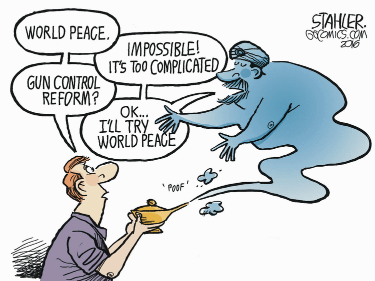

>Course: COMPSCI 109A
>Group Number: 40
>Group Members: Jonathan Iyandemye, Nate Vernon & Astrid Pineda

Among the 18 largest metropolitan areas in the US, there has been an increasing trend throughout the last 10 years in the annual number of reported murders per 100,000 inhabitants. 

Our goal with this project is to build a model to predict murder rates among the United States' metropolitan areas. For this, we use data on demographic characteristics for over 400 Metropolitan Statistical Areas (MSAs) and for the period covering 2006-2016. 

